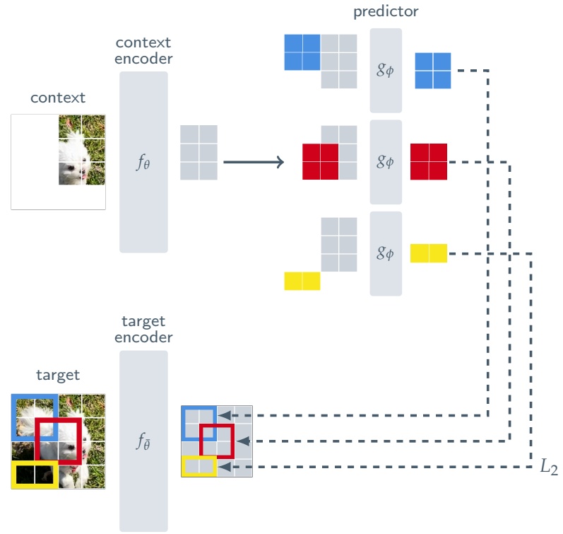
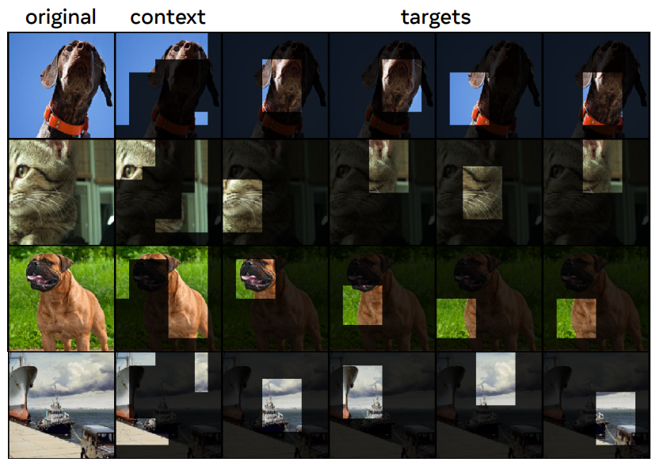
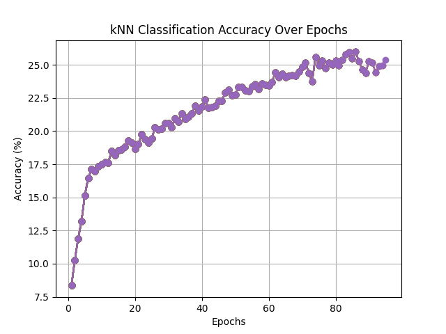
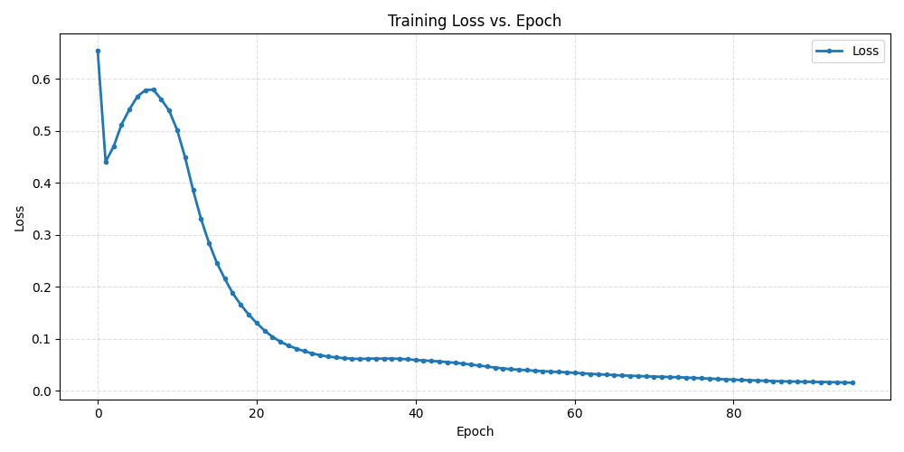

# I-JEPA and Band-I-JEPA
This repository implements I-JEPA from ["Self-Supervised Learning from Images with a Joint-Embedding Predictive Architecture"](https://arxiv.org/abs/2301.08243) and a hyperspectral Band-I-JEPA variant. The Houston runner trains both models with the same data, masking, optimizer, seed, and kNN probe so their representations can be compared fairly.

The baseline disables spectral and spatial Fourier gating. Band-I-JEPA enables both gates: a learnable 1-D band-axis filter before patch projection and a learnable 2-D spatial-frequency filter inside the encoder.

-----------
## What is I-JEPA?
I-JEPA is a self-supervised learning method. Its core idea is to learn useful representations by predicting high-level features of masked regions in an image, rather than reconstructing raw pixels.




**Figure 3. taken from the official paper (https://arxiv.org/abs/2301.08243) page 3** 

---------------

### Architecture overview 
It consists of three separate Vision Transformers:

- Context encoder (student): Processes the visible part of the image.
- Target encoder (teacher): Provides representations for the masked regions.
- Predictor: Maps the context representation to the target representation space.

### Training process

In the first step, multiple so-called target blocks are sampled from the original image, as depicted in the figure below. Additionally, a context block is sampled, in which all overlapping content with the target blocks is removed. The sampled target blocks are passed through the target encoder to obtain target representations. The context block is passed through the context encoder to obtain a context representation. The goal of the predictor is to predict the target representations from the context representation.

By doing so the context encoder is forced to extract useful information from the context block so the Predictor is able to correctly predict the representations of the missing image patches (target representations).



**Figure 4. taken from the official paper (https://arxiv.org/abs/2301.08243) page 4** 


-------------------
## Requirements
- Python 3.9+
- PyTorch 1.12+ 
- torchvision
- matplotlib (for k‑NN accuracy plots)

--------------------
## Run training
Training can be started by simply executing the main file. All training related Hyperparameters are initialized right at the start
```
python main.py
```

## Houston 2013/2018 comparison

Houston18 in this workspace contains:

- `Houston18.mat`: HDF5 MATLAB file with `ori_data`, shape `48 x 954 x 210`.
- `Houston18_7gt.mat`: HDF5 MATLAB file with `map`, shape `954 x 210`, containing 7 classes and background label 0.
- `Houston18_Tr.mat` and `Houston18_Te_gt.mat`: pre-extracted training patches and test labels without matching train coordinates. They are not used because the train labels cannot be aligned safely to `Houston18_Tr`.

The experiment uses the full cube and class map, then creates a deterministic stratified split with 20% train and 80% test pixels. With seed 42 this produces 10,637 training samples and 42,563 test samples, matching the supplied Houston18 split counts.

Install the dependencies and run the comparison:

```
chmod +x run_houston18.sh
./run_houston18.sh
```

On a server, optional environment variables can control the run:

```
EPOCHS=100 BATCH_SIZE=32 NUM_WORKERS=8 SEED=42 KNN_EVERY=1 KNN_JOBS=1 ./run_houston18.sh Houston2018 Results/Houston2018
```

The script installs `requirements-houston.txt`, trains both models with the same split and seed, and writes progress after every epoch. Resume is enabled by default, so rerunning the same command continues from:

```
Results/Houston2018/i_jepa_last.pt
Results/Houston2018/band_i_jepa_last.pt
```

Set `RESUME=0` to ignore existing checkpoints and start over. If the full brute-force kNN probe is too slow for a server time limit, increase `KNN_EVERY` to evaluate every N epochs while still evaluating the final epoch. Increase `KNN_JOBS` only when the job has enough CPU allocated for sklearn's brute-force kNN step.

The final run writes:

```
Results/Houston2018/score_table.csv
Results/Houston2018/score_table.json
Results/Houston2018/training_history.csv
Results/Houston2018/training_loss.png
Results/Houston2018/knn_accuracy.png
```

`score_table.csv` reports final kNN accuracy, balanced accuracy, macro-F1, best kNN accuracy, and the best epoch for each model. `training_history.csv` contains training MSE and kNN accuracy for every epoch. The higher kNN accuracy is the better representation for this split. Band-I-JEPA may help when spectral signatures and spatial texture are discriminative; the baseline can still win if the Fourier gates overfit or the training budget is too small. For a stronger conclusion, repeat with at least three seeds.
-------------------
## Key hyperparameters:
```
warmup_epochs = 10  
initial_lr = 0.003
ema_initial_momentum = 0.996 
initial_weight_decay = 0.04
final_weight_decay = 0.4
```

--------------------
# Results
The following shows the results of a 100 epoch long training run with the standard hyperparameters
## kNN validation accuracy change over epochs
For measuring the quality of a learned representations the kNN validation accuracy is computed after every epoch. I-JEPA with ViT-Tiny delivers 25.98% top-1 accurcy after 85 epochs of training. 

**Figure 1.** kNN Validation accuracy change over training epochs



---------------------

## Training loss change over epochs
Looking at the loss the typical behaviour of self-supervised computer vision models can be seen. Right at the beginning of the training where representation quality is low (see Figure 1.) the context encoder can learn to predict the yet non-discriminative representations of the target encoder very fast. After the first two epochs the representation quality of the target encoder starts to increase capturing more and more relevant content of the image, which makes the prediction of those representations harder. After the peak at epoch 7 the context encoder catches up and over the following epochs learns to predict the representations of the target encoder from its context block.

**Figure 2.** MSE loss change over training epochs




------------------
# References 
Official paper: ["Self-Supervised Learning from Images with a Joint-Embedding Predictive Architecture"](https://arxiv.org/abs/2301.08243)
